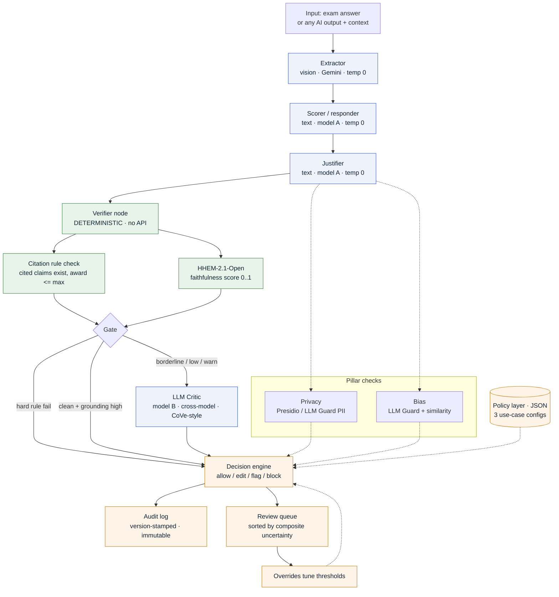
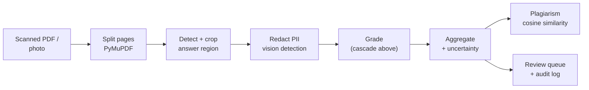

# ControlPlane.ai

> **A Responsible AI Checker: a black-box guardrail layer that flags hallucination, privacy leaks, and bias in AI output before it reaches a user.**

Built for the Accenture Innovation Challenge (Round 2). ControlPlane.ai generalizes my Round 1 project, **GradeOps** (a human-in-the-loop grading pipeline), whose critic-and-grounding mechanism was effectively a narrow responsible-AI checker. Round 2 extracts that engine into a general checker that can wrap any AI output, and keeps the exam-grading pipeline as the worked vertical.

STACK - FastAPI, React, LangGraph, HHEM-2.1-Open.
DB - SQLite / PostgreSQL

---

## What it does

Enterprises run generative AI across many use cases at once (customer chatbots, internal copilots, decision-support tools), each with a different risk tolerance. ControlPlane.ai sits over that output as a checker and:

1. **Detects** hallucination (grounding), privacy leaks (PII), and bias, using deterministic checks first and an LLM judge only when needed.
2. **Decides** a tier per output — allow / edit / flag / block — driven by a per-use-case policy.
3. **Logs** every decision to an immutable, version-stamped audit trail.

The grading vertical (GradeOps) is the concrete demo: it reads scanned handwritten exams, redacts student identifiers, grades against a rubric with partial credit, and routes uncertain grades to a human review dashboard.

---

## What Round 2 added on top of GradeOps

| Area | GradeOps (Round 1) | ControlPlane.ai (Round 2) |
|------|--------------------|---------------------------|
| Determinism | temperature unset (stochastic) | explicit **temp 0**, reproducible |
| Grounding | LLM critic only | **HHEM-2.1-Open** faithfulness score + deterministic citation verifier + cross-model critic |
| Decisions | pass/fail | **tiered** allow / edit / flag / block |
| Policy | one rubric | **JSON policy layer**, 3 use-case configs |
| Scope | exam grader | **general checker** via `POST /api/check` |
| Privacy | fixed top-strip mask (missed angled photos) | **vision-based PII detection + redaction** anywhere on the page |
| Confidence | multi-pass variance | composite **uncertainty** (HHEM + rules + critic + flags) |
| Cost | 2 vision calls/crop, frequent rate-limit breaks | 1 vision call/crop, free CPU grounding, throttled |

---

## Architecture



Green nodes are deterministic (CPU, no API), blue are LLM calls, orange is the governance layer. The gate runs the cheap deterministic checks first and only invokes the LLM critic on borderline cases, which protects both latency and free-tier quota.

---

## The grading vertical (GradeOps pipeline)

The exam-grading path is the concrete, end-to-end demonstration of the checker.



---

## Features

- **General checker API** : `POST /api/check` runs grounding + PII + bias over any output and returns a tiered decision under a chosen policy.
- **Grounding (hallucination)** : HHEM-2.1-Open faithfulness scoring on CPU (no API), plus a deterministic verifier that every awarded point cites a real claim.
- **Privacy** : vision-based detection and redaction of name / roll / date / email anywhere on a page, before any external call.
- **Bias** : output-side bias scanning plus similarity-as-fairness (near-identical answers scored differently get flagged).
- **Tiered decisions + policy layer** : three use-case configs (customer support, internal knowledge, decision support) with different risk tolerances.
- **Deterministic + auditable** : temperature 0, reproducible, every decision stamped with rubric / prompt / model versions.
- **Review dashboard** : side-by-side answer + AI grade, sorted by uncertainty, keyboard shortcuts (`Enter / O / F / J / K`).
- **Plagiarism** : cosine similarity over transcripts using sentence-transformers.

---

## Tech Stack

| Layer | Technology |
|-------|-----------|
| Frontend | React 18, Vite, Tailwind CSS |
| Backend | FastAPI, Python |
| Agentic AI | LangGraph, LangChain |
| LLM (default) | Gemini 2.5 Flash Lite (per-role routing; swap text/critic to Groq or Claude via env) |
| Grounding | HHEM-2.1-Open (Vectara), CPU |
| OCR / vision | Gemini Vision (hosted) / Qwen-VL (GPU) |
| Plagiarism | `sentence-transformers/all-MiniLM-L6-v2` |
| PDF Ingestion | PyMuPDF |
| Database | SQLAlchemy + SQLite (dev) / PostgreSQL (prod) |
| Deployment | Hugging Face Spaces (Docker) |

---

## Quick Start

```bash
# 1. Clone and set up
git clone <your-repo-url>
cd controlplane-ai
python -m venv .venv
source .venv/bin/activate        # Windows: .venv\Scripts\Activate.ps1
pip install -r requirements.txt

# 2. Configure
cp .env.example .env
# set GOOGLE_API_KEY at minimum.
# For an all-Gemini setup (no Groq key), also set:
#   TEXT_PROVIDER=google
#   CRITIC_PROVIDER=google

# 3. Run (backend also serves the built frontend in production)
uvicorn backend.main:app --reload --port 8000
# open http://localhost:8000

# 4. Frontend dev server (optional, separate terminal)
cd frontend && npm install && npm run dev
```

Try the general checker:

```bash
curl -X POST http://localhost:8000/api/check \
  -H "Content-Type: application/json" \
  -d '{"use_case":"decision_support","output":"The capital of France is Berlin.","context":"Its capital is Paris."}'
# -> tier: block, grounding risk high
```

---

## Environment Variables

```env
LLM_PROVIDER=google
GOOGLE_API_KEY=AIzaSy...
GRADER_MODEL_GOOGLE=gemini-2.5-flash-lite

# Per-role routing. Vision must be a vision-capable provider (google/anthropic).
# Text and critic can go to Groq (fast, free) or stay on google.
TEXT_PROVIDER=google
CRITIC_PROVIDER=google
GROQ_API_KEY=

# Determinism (Lane A): temp 0, single pass.
GRADER_TEMPERATURE=0.0
GRADER_NUM_PASSES=1
GRADER_CRITIC_RETRY=0
LLM_MIN_GAP_SECONDS=4.5

# Grounding (HHEM-2.1-Open; CPU, no API).
HHEM_ENABLED=true
HHEM_HIGH_THRESHOLD=0.7
HHEM_LOW_THRESHOLD=0.4

OCR_BACKEND=hosted
DATABASE_URL=sqlite:///./gradeops.db
STORAGE_ROOT=./storage
PLAGIARISM_THRESHOLD=0.82
EMBEDDING_MODEL=sentence-transformers/all-MiniLM-L6-v2
```

---

## Project Structure

```
controlplane-ai/
├── backend/
│   ├── main.py               FastAPI app (also serves frontend in prod)
│   ├── checker.py            General "check any output" entrypoint
│   ├── checker_api.py        /api/check + /api/policies routes
│   ├── confidence.py         Composite review-queue uncertainty
│   ├── fairness.py           Similarity-as-fairness flags
│   ├── checks/               grounding / PII / bias checks
│   ├── policy/               3 use-case policy configs + loader
│   ├── decision/             Tiered decision engine
│   ├── grader/
│   │   ├── graph.py          LangGraph cascade
│   │   ├── nodes.py          Extractor / Scorer / Justifier / Critic
│   │   ├── cascade.py        Deterministic verifier node + gate
│   │   ├── grounding.py      HHEM faithfulness scoring
│   │   ├── rules.py          Deterministic citation verifier
│   │   ├── llm.py            Per-role LLM factory
│   │   └── rate_limit.py     Global throttle (free-tier safe)
│   ├── ingestion/            PDF split, crop, vision-based PII redaction
│   └── ocr/                  Hosted vision + Qwen-VL adapters
├── frontend/
│   └── src/pages/            Rubrics / Grading / Review / Audit
└── scripts/                  eval harness, eval-set generator, pregrade
```

---

## API Endpoints

| Endpoint | Description |
|----------|-------------|
| `POST /api/check` | Run the checker over any AI output; returns a tiered decision |
| `GET /api/policies` | List the use-case policies |
| `GET /api/health` | Provider + per-role model + OCR backend status |
| `POST /api/papers/upload` | Grade an exam paper (the vertical demo) |
| `GET /api/review/queue` | Review queue, sorted by uncertainty |
| `GET /api/audit` | Immutable decision log |
| `GET /api/stats` | Dashboard metrics |
| `GET /docs` | Full Swagger UI |

---

## Evaluation

The checker's false-positive / negative rate is measured deterministically via error injection (no API calls):

```bash
python scripts/make_eval_set.py --out data/eval/set.jsonl --n 40
python scripts/eval.py --set data/eval/set.jsonl --out data/eval
```

This corrupts known-correct grades (unsupported award, fabricated citation, inflated award) and reports the checker's precision / recall / F1 and a per-injection catch rate.

---

## Deployment (Hugging Face Spaces)

Docker SDK Space. Set `GOOGLE_API_KEY` (and the routing vars above) as Space secrets. For demo reliability, pre-grade the demo set and bake the resulting `gradeops.db` into the image so the live demo needs no LLM call.

---

## Lineage

ControlPlane.ai is the Round 2 evolution of GradeOps (`github.com/samsadar236/gradeops`). The commit history of this repository includes the full GradeOps lineage followed by the ControlPlane generalization, so the progression is on the record.
